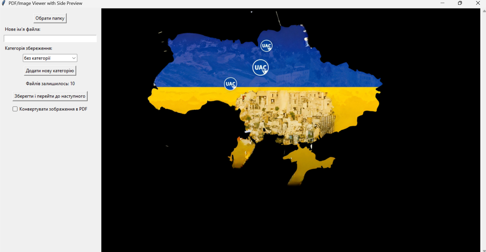

# 📁 PDF/Image Organizer with Preview

[](https://www.python.org/)
[](LICENSE)
[](https://pymupdf.readthedocs.io/)

A desktop application for organizing PDFs and images with live preview, category management, and optional image-to-PDF conversion.



## ✨ Features
- Preview PDF/JPEG/PNG files
- Convert images to PDF
- Customizable categories
- Auto-indexing to prevent overwrites
- Keyboard shortcuts
- Portable EXE build support

## 🚀 Installation
```bash
git clone https://github.com/NoobSaibot-jpg/uak_prj.git
cd uak_prj
pip install -r requirements.txt
